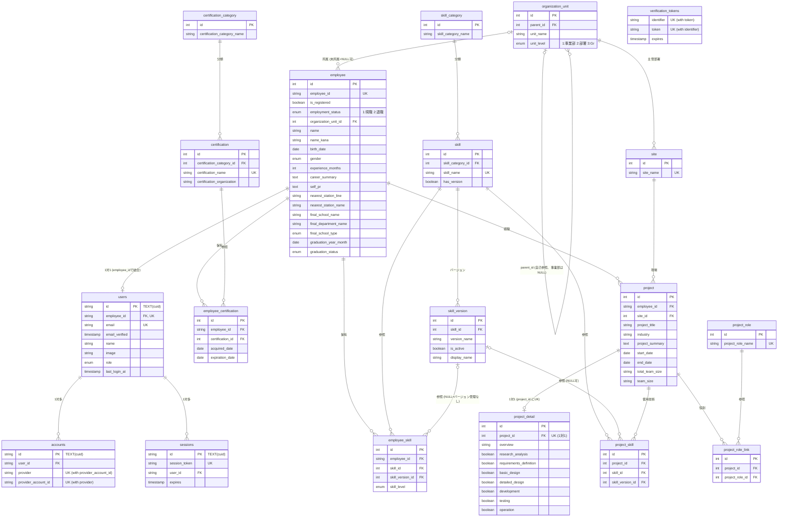

# ER図

Mermaid記法。GitHub/VS Code/Claude Codeでそのまま図としてレンダリングされる。システムカラム（作成日・更新日・削除日等）は省略。

```mermaid
erDiagram
    organization_unit |o--o{ organization_unit : "parent_id (自己参照、事業部はNULL)"
    organization_unit |o--o{ employee : "所属 (未所属=NULL可)"
    employee ||--o| users : "1対1 (employee_idで結合)"
    users ||--o{ accounts : "1対多"
    users ||--o{ sessions : "1対多"
    employee ||--o{ employee_skill : "保有"
    employee ||--o{ employee_certification : "保有"
    employee ||--o{ project : "経験"
    skill_category ||--o{ skill : "分類"
    skill ||--o{ skill_version : "バージョン"
    skill ||--o{ employee_skill : "参照"
    skill ||--o{ project_skill : "参照"
    skill_version |o--o{ employee_skill : "参照 (NULL=バージョン管理なし)"
    skill_version |o--o{ project_skill : "参照 (NULL可)"
    certification_category ||--o{ certification : "分類"
    certification ||--o{ employee_certification : "参照"
    site ||--o{ project : "現場"
    organization_unit ||--o{ site : "主管部署"
    project ||--o| project_detail : "1対1 (project_id にUK)"
    project ||--o{ project_skill : "使用技術"
    project ||--o{ project_role_link : "役割"
    project_role ||--o{ project_role_link : "参照"

    organization_unit {
        int id PK
        int parent_id FK
        string unit_name
        enum unit_level "1:事業部 2:部署 3:Gr"
    }
    employee {
        int id PK
        string employee_id "UK"
        boolean is_registered
        enum employment_status "1:現職 2:退職"
        int organization_unit_id FK
        string name
        string name_kana
        date birth_date
        enum gender
        int experience_months
        text career_summary
        text self_pr
        string nearest_station_line
        string nearest_station_name
        string final_school_name
        string final_department_name
        enum final_school_type
        date graduation_year_month
        enum graduation_status
    }
    users {
        string id PK "TEXT(cuid)"
        string employee_id "FK, UK"
        string email "UK"
        timestamp email_verified
        string name
        string image
        enum role
        timestamp last_login_at
    }
    accounts {
        string id PK "TEXT(cuid)"
        string user_id FK
        string provider "UK (with provider_account_id)"
        string provider_account_id "UK (with provider)"
    }
    sessions {
        string id PK "TEXT(cuid)"
        string session_token "UK"
        string user_id FK
        timestamp expires
    }
    verification_tokens {
        string identifier "UK (with token)"
        string token "UK (with identifier)"
        timestamp expires
    }
    skill_category {
        int id PK
        string skill_category_name
    }
    skill {
        int id PK
        int skill_category_id FK
        string skill_name "UK"
        boolean has_version
    }
    skill_version {
        int id PK
        int skill_id FK
        string version_name
        boolean is_active
        string display_name
    }
    employee_skill {
        int id PK
        string employee_id FK
        int skill_id FK
        int skill_version_id FK
        enum skill_level
    }
    certification_category {
        int id PK
        string certification_category_name
    }
    certification {
        int id PK
        int certification_category_id FK
        string certification_name "UK"
        string certification_organization
    }
    employee_certification {
        int id PK
        string employee_id FK
        int certification_id FK
        date acquired_date
        date expiration_date
    }
    site {
        int id PK
        string site_name "UK"
    }
    project {
        int id PK
        string employee_id FK
        int site_id FK
        string project_title
        string industry
        text project_summary
        date start_date
        date end_date
        string total_team_size
        string team_size
    }
    project_role {
        int id PK
        string project_role_name "UK"
    }
    project_role_link {
        int id PK
        int project_id FK
        int project_role_id FK
    }
    project_detail {
        int id PK
        int project_id FK "UK (1対1)"
        string overview
        boolean research_analysis
        boolean requirements_definition
        boolean basic_design
        boolean detailed_design
        boolean development
        boolean testing
        boolean operation
    }
    project_skill {
        int id PK
        int project_id FK
        int skill_id FK
        int skill_version_id FK
    }
```
