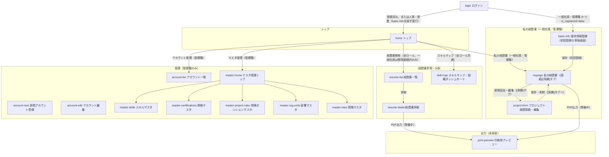

# 画面遷移図

Mermaid記法。GitHub/VS Code/Claude Codeでそのまま図としてレンダリングされる。

<!--
この図の読み方・方針:
- 主要な業務遷移のみを描く。パンくずリストによる上位階層への移動
  （全画面共通、loginを除く）と「戻る」は矢印を省略している
- エッジのラベルはボタン・条件を表す。ロール制限があるものはラベルに記載
- confirm-dialog（削除確認モーダル）は画面遷移を伴わないため図に含めない
  （呼び出し元: project-form・account-edit・master-*。詳細はscreens.md参照）
- print-preview（印刷用プレビュー）への遷移は未実装（resume-detail/mypageに
  「準備中」表示のみ）。図には目指す仕様として記載している
- 本図はscreens.md・schema.mdの確定仕様と整合させている
-->

## 補足

- **アカウント管理**: account-listから「新規アカウント登録」でaccount-newへ、行の「編集」でaccount-editへ。保存後はどちらもaccount-listへ戻る
- **人事・営業の初回ログイン**: 経歴書を作成しないため、basic-info（初回登録）を経ずhomeへ直行する。ログイン成立時に`is_registered`を自動でTRUEに更新（login参照）
- **ログインのエラー分岐**（未登録／退職済み／プロバイダ不一致）は遷移を伴わない（loginに留まる）ため図から省略。文言はscreens.mdのlogin参照
- **account-editの退職処理・現職に戻す**は`employment_status`による排他表示。どちらもconfirm-dialogで確認後、account-editに留まる
- **PDF出力（print-preview）は未実装**。resume-detail/mypageには「準備中」タイルのみ配置している。Excel出力は提供しない
